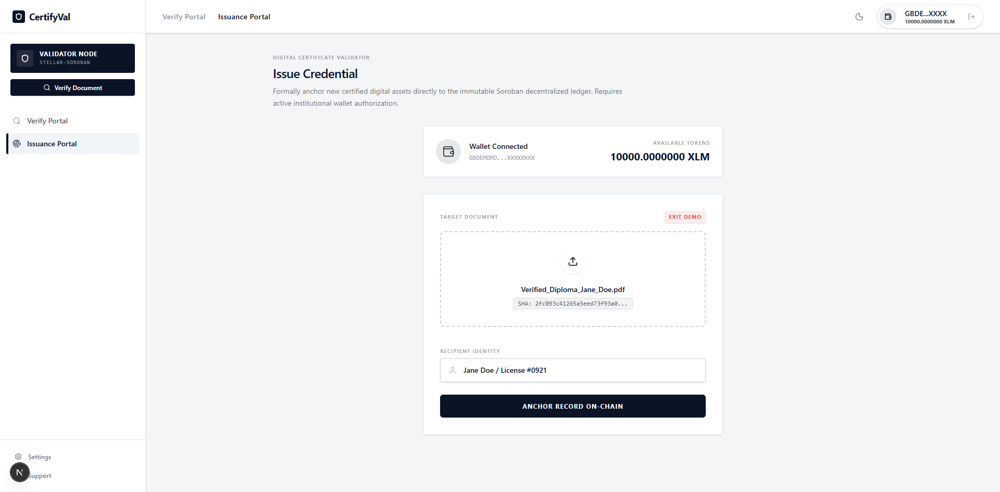
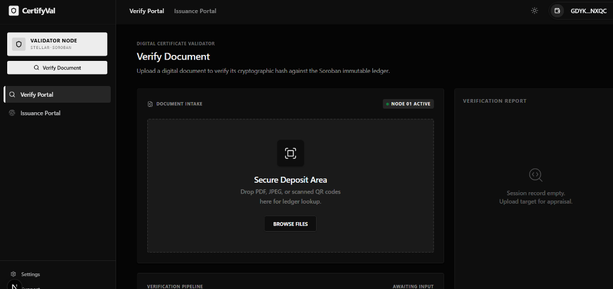
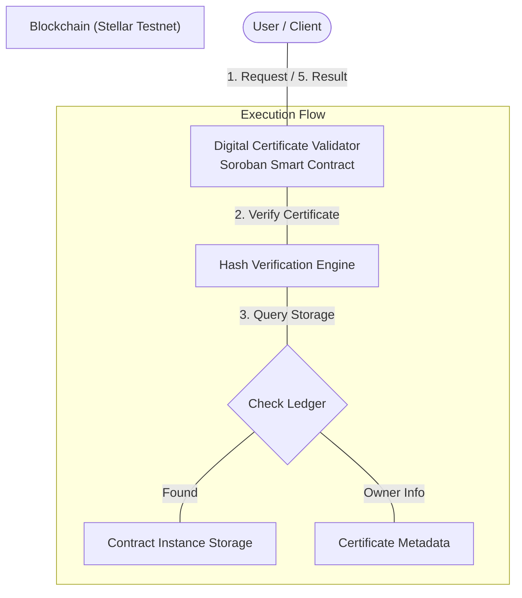
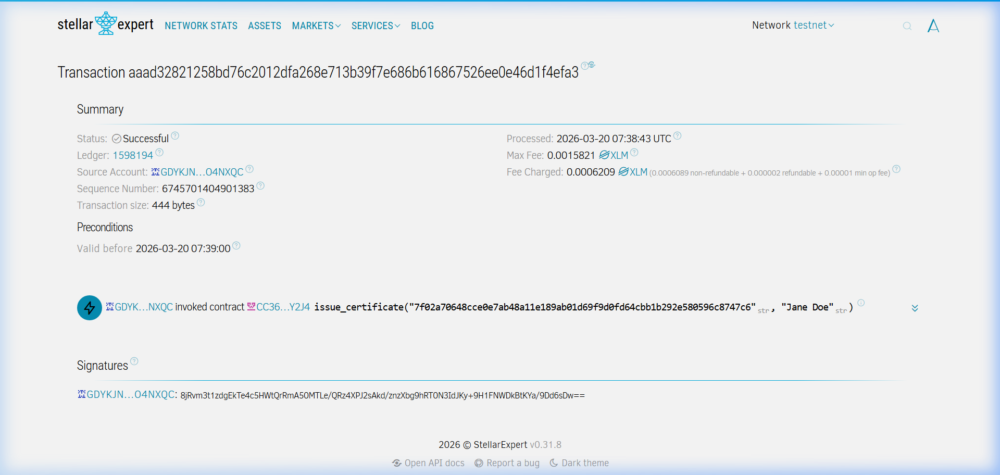
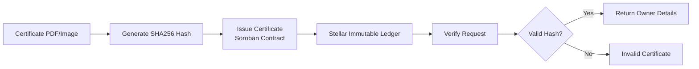

<div align="center">
  <h1>Digital Certificate Validator</h1>
  <p><b>Blockchain-Based Certificate Issuance & Verification on Stellar</b></p>

  <p>🌐 <strong>Live Application: <a href="https://digital-certificate-validator-full-phi.vercel.app/">https://digital-certificate-validator-full-phi.vercel.app/</a></strong></p>

  
  
  
  
  
  <br><br>

  
  
  <br><br>

  

  <br><br>

  <i>Digital Certificate Validator allows institutions to issue and verify tamper-proof certificates using secure cryptographic hashes on the Stellar Soroban network.</i>

  <br><br>

  <a href="#problem-statement">Problem</a> • 
  <a href="#solution">Solution</a> • 
  <a href="#contract">Live Transaction</a> • 
  <a href="#architecture">Architecture</a> • 
  <a href="#ui-refresh">UI Refresh</a> • 
  <a href="#plan">Pipeline</a> • 
  <a href="#setup">Quick Start</a>
</div>

---

<a name="ui-refresh"></a>
## 🌟 Enterprise UI Overhaul (v2.0)

The project has undergone a massive vertical-to-horizontal layout shift, adopting a modern, high-density **Enterprise B2B Aesthetic**. 

### ✨ Key New Features
- 🌗 **Dynamic Theme Engine**: Full support for high-contrast Light and rich "True Black" Dark modes.
- 🚀 **Real-time Verification Pipeline**: A visual terminal and step-by-step progress tracker for blockchain lookups.
- 📋 **On-Chain Audit Exports**: Generate authenticated `.txt` audit logs and CSV ledger exports directly from the dashboard.
- 🔒 **Enhanced Security (Native Bytes)**: Migrated from String-based hashes to native Soroban `Bytes` for 1:1 cryptographic matching and reduced on-chain footprint.
- 🤖 **Automated Demo Mode**: Built-in sandbox for rapid testing without requiring real testnet funds (accessible via `?demo=true`).

---

## 📖 What is this?

**Digital Certificate Validator** is an institutional-grade blockchain infrastructure built for the verification economy. It allows organizations to issue tamper-proof certificates instantly with minimal transaction costs on the Stellar network. Every certificate is secured by a **SHA256 cryptographic hash**, ensuring decentralized authenticity before any manual verification is needed.

Give it a certificate hash like `e3b0c442...` — it automatically:

1. **Checks the request** via the Stellar Soroban network.
2. **Verifies existence** of the unique certificate hash on the immutable ledger.
3. **Retrieves ownership** details tied to the specific hash in real-time.
4. **Logs the verification** on-chain ensuring auditability.
5. **Returns a valid/invalid status** once the blockchain settlement is confirmed.

---

<a name="problem-statement"></a>
## 🔴 Problem Statement

The current landscape of digital certification is hindered by several systemic challenges:
- **Widespread Forgery**: Standard digital formats like PDFs are easily manipulated, leading to a rise in fraudulent credentials.
- **Verification Lag**: Validating a certificate typically requires slow, manual verification from the issuing authority.
- **Centralized Fragility**: Reliance on centralized servers makes records vulnerable to data breaches or systemic failures.
- **Economic Barriers**: High transaction fees on traditional blockchains often make widespread certification cost-prohibitive.

<a name="solution"></a>
## 🟢 The Solution

**Digital Certificate Validator** leverages the Stellar Soroban network to provide a secure, scalable, and instant verification framework:
- **Immutable Trust**: Each certificate is hashed (SHA256) and recorded on the Stellar ledger, creating a permanent, unalterable record.
- **Real-Time Audits**: Verification happens instantly via smart contract calls, removing the need for manual institutional intervention.
- **Privacy by Design**: By storing only cryptographic fingerprints on-chain, we ensure data privacy while maintaining absolute authenticity.
- **Cost-Effective Scaling**: Optimized Soroban storage allows for high-volume issuance at a fraction of the cost compared to other L1 blockchains.

---

## 🔑 Why Soroban?

> **The secret sauce for high-performance certificate validation**

### The Problem
Traditional methods of issuing digital certificates on the blockchain often face:
- **High gas fees** that make mass-issuance impossible.
- **Slow confirmation times** leading to poor user experience.
- **Complex storage logic** for large-scale certificate mappings.
- **Privacy concerns** with storing sensitive data directly on-chain.

### Why We Chose Soroban

| Feature | Traditional Chains | With Soroban |
|:--- |:--- |:--- |
| **Transaction Fees** | High/Unpredictable | ✅ **Near-Zero & Predictable** |
| **Execution Speed** | Seconds to Minutes | ✅ **Local-speed Sub-second** |
| **Type Safety** | Varies by Language | ✅ **Rust-based Type Safety** |
| **Storage Model** | Expensive/Monolithic | ✅ **Optimized Instance Storage** |
| **Ecosystem** | Fragmented | ✅ **Unified Stellar Network** |

### Soroban Features We Use
- **`instance()` Storage** — Efficiently maintains the persistent certificate-to-owner mapping.
- **`SHA256` Hashing** — Leveraging Soroban's native capabilities for secure validation.
- **`symbol_short!()`** — Optimizing on-chain memory by using compact storage identifiers.
- **`Env` SDK** — Direct interaction with the global ledger state with minimal overhead.

---

<a name="architecture"></a>
## 🏗️ Architecture

### High-Level Flow



The architecture follows a clean decentralized flow:
1. **Institution**: Generates the certificate (PDF/Image) and computes its **SHA256 hash**.
2. **Smart Contract**: The institution calls `issue_certificate` to store the hash and owner's name on the Stellar ledger.
3. **Stellar Blockchain**: Acts as the immutable source of truth for all certificate hashes.
4. **Verifier**: A user or third-party enters the certificate hash; the contract verifies its existence and returns the owner details.

---

## 🛠️ Tech Stack & Tools

- **[Rust](https://doc.rust-lang.org/book/)**: Core programming language for the smart contract.
- **[Soroban-SDK](https://developers.stellar.org/docs/tools/sdks/library)**: Framework for Stellar smart contracts.
- **[Next.js 15+](https://nextjs.org/)**: React framework for the modern enterprise frontend.
- **[Tailwind CSS](https://tailwindcss.com/)**: Utility-first CSS for the rapid, clean design system.
- **[Framer Motion](https://www.framer.com/motion/)**: For smooth, high-end UI transitions and animations.
- **[Stellar CLI](https://developers.stellar.org/docs/tools/developer-tools/stellar-cli)**: For building, deploying, and invoking contracts.
- **[Stellar Explorer](https://stellar.expert/explorer/testnet/contract/CC36B2WFEDYK3GN6F65B7RKAYINW3MGNPYZ2ZG3TM4CQDJQGJURLY2J4)**: To track transactions and contract state.
- **SHA256 Hashing**: For secure, one-way certificate fingerprinting using local crypto or Soroban native SDKs.

### 💳 Supported Wallets
The CertifyVal suite integrates with the following Stellar wallets:
- **Freighter Wallet** (Recommended)
- **Albedo** (Web-based)
- **xBull Wallet**
- **MetaMask** (via Official Stellar Snap)
- **LOBSTR** (Manual transaction signature)

---

<a name="contract"></a>
## 🔗 Deployed Contract
**Address**: `CC36B2WFEDYK3GN6F65B7RKAYINW3MGNPYZ2ZG3TM4CQDJQGJURLY2J4`
- [View on Stellar.Expert Explorer](https://stellar.expert/explorer/testnet/contract/CC36B2WFEDYK3GN6F65B7RKAYINW3MGNPYZ2ZG3TM4CQDJQGJURLY2J4)

### 📸 Smart Contract Dashboard


---

## ✅ Proof of Payment

> **Real transaction on Stellar Soroban Testnet**

| Field | Value |
|:---|:---|
| **Transaction Hash** | `aaad32821258bd76c2012dfa268e713b39f7e686b616867526ee0e46d1f4efa3` |
| **Function Called** | `issue_certificate` |
| **Certificate Hash** | `7f02a70648cce0e7ab48a11e189ab01d69f9d0fd64cbb1b292e580596c8747c6` |
| **Recipient** | `Jane Doe` |
| **Status** | ✅ Success |
| **Network** | Stellar Soroban (Testnet) |
| **Processed** | 2026-03-20 07:38:43 UTC |
| **Fee Charged** | `0.0006209 XLM` |
| **Ledger** | `1598194` |

🔗 [View on Stellar Expert](https://stellar.expert/explorer/testnet/tx/aaad32821258bd76c2012dfa268e713b39f7e686b616867526ee0e46d1f4efa3)

### 📸 Transaction Proof Screenshot


---

## 🎯 Vision & Use Cases

### Vision
Our vision is to eliminate certificate fraud and streamline the verification process across industries. By leveraging Stellar's low-cost and high-speed network, we aim to provide a globally accessible standard for digital credentials.

### Key Use Cases
- **University Certificates**: Ensuring academic credentials cannot be forged.
- **Online Courses**: Providing verifiable proof of completion for digital learning platforms.
- **Government Documents**: Secure verification for high-stake IDs and permits.
- **Employee Verification**: Streamlining the background check process for employers.

---

<a name="plan"></a>
## 🏗️ Pipeline (Development Plan)



### 1. Smart Contract Functions
The contract includes key functions to manage the lifecycle of a certificate:

- **`issue_certificate(env: Env, cert_hash: String, owner: String)`**: 
  - Allows an institution to register a certificate hash.
  - Links the hash to the owner's name.
  - Persistence: Stores data in the contract's instance storage.

- **`verify_certificate(env: Env, cert_hash: String) -> bool`**: 
  - Checks if a certificate hash exists on the blockchain.
  - Returns `true` if valid, `false` otherwise.

- **`get_owner(env: Env, cert_hash: String) -> String`**: 
  - Retrieves the name of the owner for a given certificate hash.

### 2. Data Structure
- **`Map<String, String>`**: Used to map `cert_hash` to `owner_name`. This ensures efficient lookup and storage management within the Soroban environment.

---

## 🔐 Access Control & Security

- **Hashing**: Certificates themselves are never stored on-chain, preserving privacy. Only the SHA256 hash (fingerprint) is stored.
- **Immutable Ledger**: Once a certificate hash is issued, it cannot be tampered with or retroactively changed.
- **Current Limitation**: Open access for demonstration.
- **Future Roadmap**: Implementation of **Role-Based Access Control (RBAC)** to ensure only authorized institution addresses can call the `issue_certificate` function.

---

## 🚧 Road Map & Future Plans

- [ ] **IPFS Integration**: Store the actual certificate files on IPFS and save the CID on-chain.
- [ ] **QR Code Verification**: Generate QR codes for certificates that link directly to the verification page.
- [ ] **Expiry System**: Allow certificates to have a "valid until" date.
- [ ] **Revocation Mechanism**: Enable institutions to revoke certificates if necessary.

## 📁 Project Structure

```text
.
├── README.md                # Main project documentation
└── contract
    ├── Cargo.toml           # Workspace configuration
    ├── README.md            # Smart contract specific guide
    └── contracts
        └── contract
            ├── Cargo.toml   # Individual contract dependencies
            ├── Makefile      # Build/Test automation
            └── src
                ├── lib.rs   # Core smart contract logic
                └── test.rs  # Unit tests
```

---

<a name="setup"></a>
## ⚙️ Environment Setup & Installation

### A) Prerequisites
1. **Install Rust**:
   ```bash
   curl --proto '=https' --tlsv1.2 -sSf https://sh.rustup.rs | sh
   ```
2. **Install Soroban CLI**:
   ```bash
   cargo install --locked soroban-cli
   ```
3. **Add WASM Target**:
   ```bash
   rustup target add wasm32-unknown-unknown
   ```

### B) Backend (Smart Contract) Setup
1. **Clone the repository**:
   ```bash
   git clone https://github.com/sohansarkar07/Digital-Certificate-Validator.git
   cd Digital-Certificate-Validator
   ```
2. **Build the contract**:
   ```bash
   soroban contract build
   ```
3. **Optimize (Optional but Recommended)**:
   ```bash
   soroban contract optimize --wasm target/wasm32-unknown-unknown/release/contract.wasm
   ```

### C) Deployment & Invocation
1. **Deploy to Testnet**:
   ```bash
   soroban contract deploy \
     --wasm target/wasm32-unknown-unknown/release/contract.wasm \
     --source <YOUR_ACCOUNT_NAME> \
     --network testnet
   ```
2. **Invoke Issue Function**:
   ```bash
   soroban contract invoke \
     --id <CONTRACT_ID> \
     --source <SOURCE_ACCOUNT> \
     --network testnet \
     -- issue_certificate --cert_hash "sha256_hash_here" --owner "John Doe"
   ```

---

### 🌐 Frontend Setup (Next.js)
1. **Navigate to frontend**:
   ```bash
   cd frontend
   ```
2. **Install dependencies**:
   ```bash
   npm install
   ```
3. **Run development server**:
   ```bash
   npm run dev
   ```
4. **Access the portal**: Open [http://localhost:3000](http://localhost:3000) in your browser.

---

## 👨‍💻 Author
**Sohan Sarkar**
- Blockchain Enthusiast | Soroban Developer
- [GitHub Profile](https://github.com/sohansarkar07)
