<div align="center">

# 🛡️ CertifyVal
### **Global Decentralized Credential Trust Platform**

> *Eliminating certificate fraud through blockchain immutability, AI fraud detection, and cryptographic verification — powered by Stellar Soroban*

<p>🌐 <strong>Live Application: <a href="https://certifyval.vercel.app/">https://certifyval.vercel.app/</a></strong></p>

<p>
  <a href="https://youtu.be/pkX4ZjrTgLw">
    
  </a>
  <a href="https://drive.google.com/file/d/13R5k0awT4VD1-IW8M5MIOfXvL9BKrIWX/view?usp=drivesdk">
    
  </a>
  <br/>
  <a href="https://docs.google.com/forms/d/e/1FAIpQLSeTacaTE5WdiziG8oA6qHFntoSKmnlPN_es5Chn5q7jiOEwbQ/viewform?usp=publish-editor">
    
  </a>
  <a href="https://docs.google.com/spreadsheets/d/1KkirRluFDUFCoo5sLA4LoxLYy0ZxEHPbe_fjbee3U7w/edit?usp=sharing">
    
  </a>
</p>


<br><br>

[Demo Video](https://youtu.be/pkX4ZjrTgLw) •
[Problem](#problem-statement) •
[Solution](#solution) •
[Architecture](#architecture) •
[AI Fraud Engine](#ai-fraud-detection) •
[Blockchain](#blockchain-architecture) •
[Database Schema](#database-schema) •
[User Flow](#user-flow) •
[Product Iteration](#product-iteration) •
[Roadmap](#roadmap) •
[Setup](#setup)
---

## 🎥 YouTube Overview

[](https://www.youtube.com/watch?v=pkX4ZjrTgLw)

</div>

---

<a name="what-is-this"></a>
## 📖 What Is CertifyVal?

**CertifyVal** is a next-generation, institutional-grade **decentralized credential trust platform** built on the Stellar blockchain. It bridges the gap between the $25B+ credential fraud industry and modern cryptographic verification technology.

Unlike simple hash-on-chain tools, CertifyVal is a **complete verification ecosystem**:

| Capability | Description |
|:---|:---|
| 🏛️ **Institution Portal** | Register, get approved, and issue tamper-proof credentials on-chain |
| 🔬 **AI Fraud Engine** | Dual-layer Groq LLM + Heuristic fraud pipeline scores every certificate |
| 🔗 **Blockchain Ledger** | Soroban smart contracts store SHA256 hashes immutably on Stellar |
| 🎒 **Credential Passport** | Students own a portable, shareable digital credential wallet |
| 👔 **Employer Dashboard** | Employers bulk-verify candidates in seconds, not days |
| 📊 **Analytics & Audit** | Real-time on-chain activity logs and exportable audit trails |
| 📧 **Email Delivery** | OTP + credential delivery via Resend email API |

> Give it a certificate — and within **2 seconds** it tells you: *Real or Fake, and who issued it, and when, and whether the issuing institution is trusted.*

---

## 📸 Platform UI Tour

| Landing Page | Issuance Portal |
|:---:|:---:|
|  |  |

| Verification Portal | Credential Passport |
|:---:|:---:|
|  |  |

| Institution Registry | Platform Analytics |
|:---:|:---:|
|  |  |

| Blockchain Activity | Developer Documentation |
|:---:|:---:|
|  |  |

---

<a name="problem-statement"></a>
## 🔴 Problem Statement

The global credentialing system is fundamentally broken. Here is the scale of the crisis:

```
  ╔══════════════════════════════════════════════════════════════╗
  ║  📊 THE CREDENTIAL FRAUD CRISIS — BY THE NUMBERS           ║
  ╠══════════════════════════════════════════════════════════════╣
  ║  • 40% of CVs contain at least one significant fabrication  ║
  ║  • $25B+ lost annually to credential fraud worldwide        ║
  ║  • Average manual verification time: 3–10 business days     ║
  ║  • 17% of licensed professionals have fraudulent degrees    ║
  ║  • Zero cryptographic verification in 95% of institutions   ║
  ╚══════════════════════════════════════════════════════════════╝
```

### Core Pain Points

**1. 🖨️ Forgery is Trivially Easy**
Standard certificates (PDF/PNG/paper) can be edited in minutes using free software. There is no cryptographic signature, no tamper detection, no way for an employer to distinguish real from fake.

**2. 🐌 Verification is Painfully Slow**
Current process: send email → wait for response → manually compare data → no guarantee of response. This takes 3–10 days per candidate.

**3. 🏚️ Centralized Fragility**
Institution servers go down. Universities close. HR records get deleted. When the central authority disappears, so does your credential's verifiability.

**4. 💸 Blockchain Economics Have Been a Barrier**
Ethereum gas fees (up to $50/tx) made blockchain-based credentialing commercially unviable for mass adoption.

**5. 🔒 Data Privacy Conflicts**
GDPR compliance and student data privacy make it difficult to publish credential data openly, creating a tension between transparency and privacy.

---

<a name="solution"></a>
## 🟢 The Solution — CertifyVal

CertifyVal solves each problem with a targeted, elegantly designed solution:

| Problem | CertifyVal's Solution |
|:---|:---|
| PDF Forgery | SHA256 hash stored immutably on Stellar — hash mismatch = detected fraud |
| Slow verification | Sub-second smart contract lookups — instant cryptographic proof |
| Centralized fragility | Decentralized Stellar ledger — no single point of failure |
| High gas fees | Soroban: ~$0.000001/tx — mass issuance becomes economically viable |
| Data privacy | Only the hash fingerprint is stored on-chain — zero PII on blockchain |
| Fraudulent institutions | On-chain Institution Registry with admin approval + stake-based accountability |

### The CertifyVal Difference

```
  Traditional System:         CertifyVal System:
  ┌──────────────┐            ┌──────────────────────────────┐
  │ PDF File     │            │ SHA256(certificate_data)     │
  │ Easy to edit │     →      │ + Soroban On-chain Proof     │
  │ No proof     │            │ + AI Fraud Score             │
  └──────────────┘            │ + Institution Trust Score    │
                              └──────────────────────────────┘
       FORGEABLE                    CRYPTOGRAPHICALLY SEALED
```

---

<a name="why-soroban"></a>
## 🔑 Why Soroban? — The Technical Case

> **Soroban is not just a blockchain — it's the perfect host for a trust protocol.**

### Competitive Analysis

| Feature | Ethereum | Solana | Cardano | **Stellar Soroban** |
|:---|:---:|:---:|:---:|:---:|
| **Tx Fee (avg)** | $5–50 | $0.001 | $0.15 | ✅ **$0.000001** |
| **Confirmation** | 12–60s | 400ms | 20s | ✅ **<5s** |
| **Language** | Solidity | Rust | Haskell | ✅ **Rust** |
| **Type Safety** | Medium | High | High | ✅ **Highest** |
| **WASM Runtime** | ❌ | ❌ | ✅ | ✅ |
| **Built-in Auth** | ❌ | ❌ | ❌ | ✅ **`require_auth`** |
| **Storage Model** | Expensive | Rent-based | UTXO | ✅ **Optimized Instance** |
| **Formal Verification** | Limited | Limited | ✅ | ✅ |

### Soroban-Specific Features We Leverage

```rust
// 1. INSTANCE STORAGE — Persistent, efficient certificate mapping
env.storage().instance().set(&cert_hash, &owner);

// 2. NATIVE AUTHENTICATION — Cryptographic wallet authorization
institution_wallet.require_auth();

// 3. SYMBOL MACROS — Compact on-chain key storage
symbol_short!("ISSUE")   // 8-byte max compressed key

// 4. EVENTS — Real-time notification system for indexers
env.events().publish((symbol_short!("ISSUE"), cert_hash), owner);

// 5. BYTES TYPE — Native SHA256 hash storage (no string padding)
cert_hash: Bytes  // Exact 32-byte match, no encoding overhead
```

---

<a name="architecture"></a>
## 🏗️ System Architecture

### High-Level Platform Overview

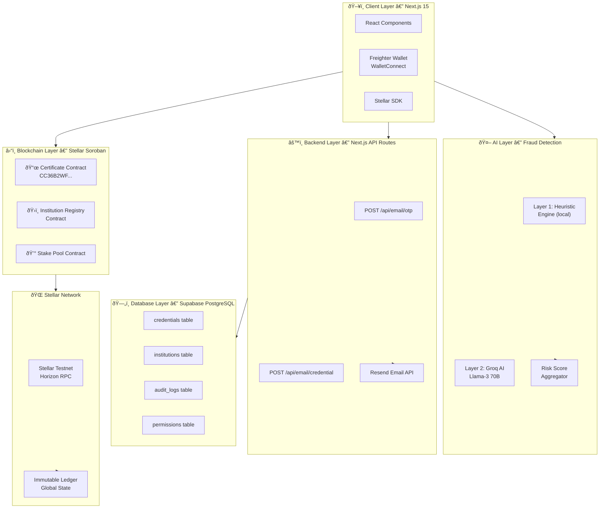
```mermaid
graph TB
    subgraph CLIENT["🖥️ Client Layer — Next.js 15"]
        UI["React Components"]
        WALLET["Freighter Wallet\nWalletConnect"]
        SDK["Stellar SDK"]
    end

    subgraph AI["🤖 AI Layer — Fraud Detection"]
        HEURISTIC["Layer 1: Heuristic\nEngine (local)"]
        GROQ["Layer 2: Groq AI\nLlama-3 70B"]
        RISK["Risk Score\nAggregator"]
    end

    subgraph BACKEND["⚙️ Backend Layer — Next.js API Routes"]
        OTP_API["POST /api/email/otp"]
        CRED_API["POST /api/email/credential"]
        RESEND["Resend Email API"]
    end

    subgraph DB["🗄️ Database Layer — Supabase PostgreSQL"]
        CREDS_TABLE["credentials table"]
        INSTS_TABLE["institutions table"]
        AUDIT_TABLE["audit_logs table"]
        PERMS_TABLE["permissions table"]
    end

    subgraph BLOCKCHAIN["⛓️ Blockchain Layer — Stellar Soroban"]
        CERT_CONTRACT["📜 Certificate Contract\nCC36B2WF..."]
        INST_CONTRACT["🏛️ Institution Registry\nContract"]
        STAKE_CONTRACT["💰 Stake Pool Contract"]
    end

    subgraph STELLAR["🌐 Stellar Network"]
        TESTNET["Stellar Testnet\nHorizon RPC"]
        LEDGER["Immutable Ledger\nGlobal State"]
    end

    CLIENT --> AI
    CLIENT --> BACKEND
    CLIENT --> BLOCKCHAIN
    AI --> RISK
    BACKEND --> RESEND
    BACKEND --> DB
    BLOCKCHAIN --> STELLAR
    STELLAR --> LEDGER

    classDef clientStyle fill:#1e3a5f,stroke:#4a9eff,color:#fff
    classDef aiStyle fill:#2d1b69,stroke:#9b59b6,color:#fff
    classDef backendStyle fill:#1a3a2a,stroke:#2ecc71,color:#fff
    classDef dbStyle fill:#3a1a0a,stroke:#e67e22,color:#fff
    classDef blockchainStyle fill:#2a1a3a,stroke:#e84142,color:#fff
    classDef stellarStyle fill:#1a2a3a,stroke:#3498db,color:#fff
```

---

<a name="user-flow"></a>
## 👤 User Flow Architecture

### Complete End-to-End User Journey

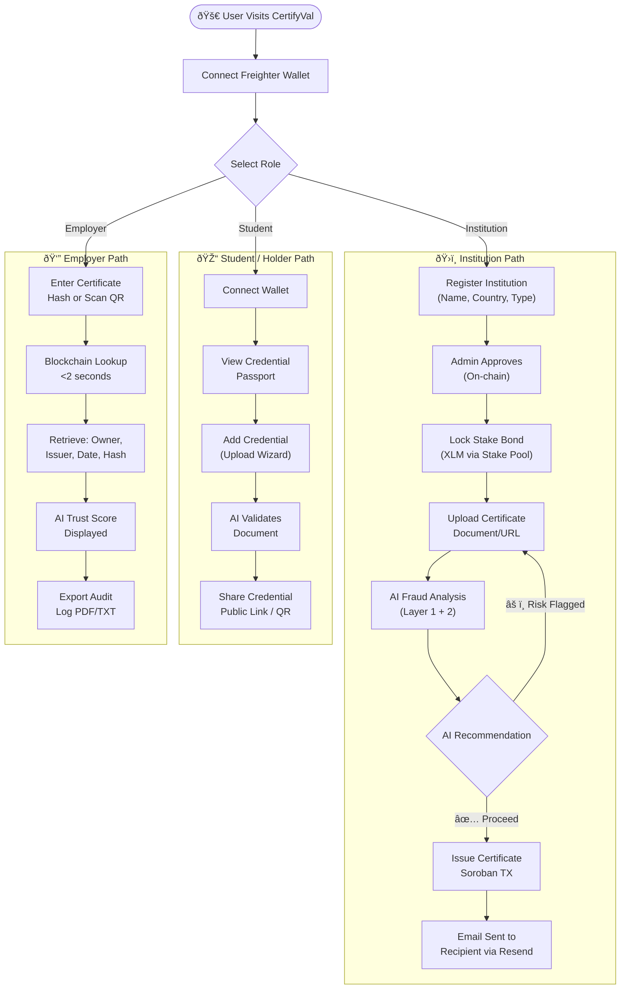
```mermaid
flowchart TD
    START(["🚀 User Visits CertifyVal"])
    CONNECT["Connect Freighter Wallet"]
    ROLE{Select Role}

    subgraph INSTITUTION_FLOW["🏛️ Institution Path"]
        I1["Register Institution\n(Name, Country, Type)"]
        I2["Admin Approves\n(On-chain)"]
        I3["Lock Stake Bond\n(XLM via Stake Pool)"]
        I4["Upload Certificate\nDocument/URL"]
        I5["AI Fraud Analysis\n(Layer 1 + 2)"]
        I6{AI Recommendation}
        I7["Issue Certificate\nSoroban TX"]
        I8["Email Sent to\nRecipient via Resend"]
    end

    subgraph STUDENT_FLOW["🎓 Student / Holder Path"]
        S1["Connect Wallet"]
        S2["View Credential\nPassport"]
        S3["Add Credential\n(Upload Wizard)"]
        S4["AI Validates\nDocument"]
        S5["Share Credential\nPublic Link / QR"]
    end

    subgraph EMPLOYER_FLOW["👔 Employer Path"]
        E1["Enter Certificate\nHash or Scan QR"]
        E2["Blockchain Lookup\n<2 seconds"]
        E3["Retrieve: Owner,\nIssuer, Date, Hash"]
        E4["AI Trust Score\nDisplayed"]
        E5["Export Audit\nLog PDF/TXT"]
    end

    START --> CONNECT
    CONNECT --> ROLE
    ROLE -->|Institution| I1
    ROLE -->|Student| S1
    ROLE -->|Employer| E1

    I1 --> I2 --> I3 --> I4 --> I5 --> I6
    I6 -->|"✅ Proceed"| I7 --> I8
    I6 -->|"⚠️ Risk Flagged"| I4

    S1 --> S2 --> S3 --> S4 --> S5

    E1 --> E2 --> E3 --> E4 --> E5

    classDef startStyle fill:#0f4c75,stroke:#1b6ca8,color:#fff,rx:20px
    classDef institutionStyle fill:#1a3a2a,stroke:#2ecc71,color:#fff
    classDef studentStyle fill:#2d1b69,stroke:#9b59b6,color:#fff
    classDef employerStyle fill:#3a1a0a,stroke:#e67e22,color:#fff
```

---

<a name="ai-fraud-detection"></a>
## 🤖 AI Fraud Detection Pipeline

CertifyVal uses a **dual-layer hybrid AI system** to detect fraudulent credentials before they are issued on-chain.

### Architecture Overview

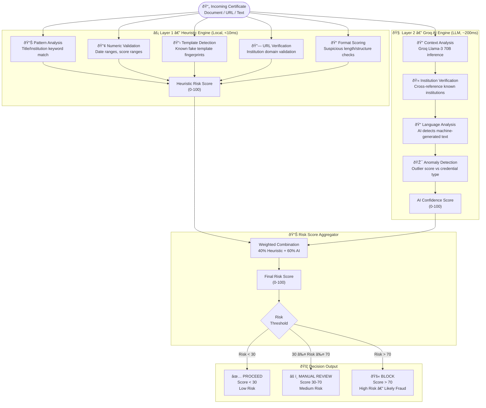
```mermaid
flowchart TD
    INPUT(["📄 Incoming Certificate\nDocument / URL / Text"])

    subgraph LAYER1["⚡ Layer 1 — Heuristic Engine (Local, <10ms)"]
        H1["📊 Pattern Analysis\nTitle/Institution keyword match"]
        H2["🔢 Numeric Validation\nDate ranges, score ranges"]
        H3["📋 Template Detection\nKnown fake template fingerprints"]
        H4["🔗 URL Verification\nInstitution domain validation"]
        H5["📏 Format Scoring\nSuspicious length/structure checks"]
        HSCORE["Heuristic Risk Score\n(0-100)"]
    end

    subgraph LAYER2["🧠 Layer 2 — Groq AI Engine (LLM, ~200ms)"]
        G1["🔍 Context Analysis\nGroq Llama-3 70B inference"]
        G2["🏫 Institution Verification\nCross-reference known institutions"]
        G3["📝 Language Analysis\nAI detects machine-generated text"]
        G4["🎯 Anomaly Detection\nOutlier score vs credential type"]
        GSCORE["AI Confidence Score\n(0-100)"]
    end

    subgraph AGGREGATOR["📊 Risk Score Aggregator"]
        WEIGHT["Weighted Combination\n40% Heuristic + 60% AI"]
        FINAL["Final Risk Score\n(0-100)"]
        DECISION{"Risk\nThreshold"}
    end

    subgraph OUTPUT["🚦 Decision Output"]
        PROCEED["✅ PROCEED\nScore < 30\nLow Risk"]
        REVIEW["⚠️ MANUAL REVIEW\nScore 30-70\nMedium Risk"]
        BLOCK["🚫 BLOCK\nScore > 70\nHigh Risk — Likely Fraud"]
    end

    INPUT --> H1
    INPUT --> H2
    INPUT --> H3
    INPUT --> H4
    INPUT --> H5
    H1 & H2 & H3 & H4 & H5 --> HSCORE

    INPUT --> G1
    G1 --> G2 --> G3 --> G4 --> GSCORE

    HSCORE --> WEIGHT
    GSCORE --> WEIGHT
    WEIGHT --> FINAL --> DECISION

    DECISION -->|"Risk < 30"| PROCEED
    DECISION -->|"30 ≤ Risk ≤ 70"| REVIEW
    DECISION -->|"Risk > 70"| BLOCK

    classDef layer1Style fill:#1a3a2a,stroke:#2ecc71,color:#fff
    classDef layer2Style fill:#2d1b69,stroke:#9b59b6,color:#fff
    classDef aggStyle fill:#3a1a0a,stroke:#e67e22,color:#fff
    classDef outputStyle fill:#1e3a5f,stroke:#4a9eff,color:#fff
```

### Heuristic Engine — Detection Rules

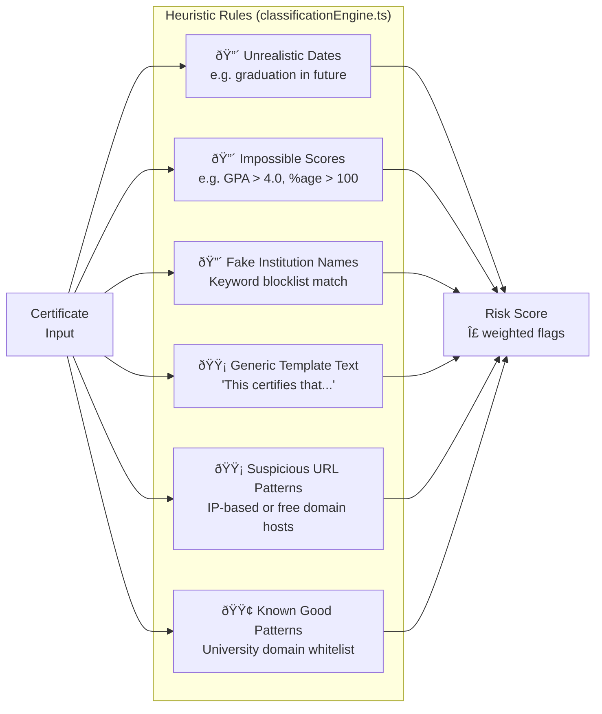
```mermaid
graph LR
    subgraph RULES["Heuristic Rules (classificationEngine.ts)"]
        R1["🔴 Unrealistic Dates\ne.g. graduation in future"]
        R2["🔴 Impossible Scores\ne.g. GPA > 4.0, %age > 100"]
        R3["🔴 Fake Institution Names\nKeyword blocklist match"]
        R4["🟡 Generic Template Text\n'This certifies that...'"]
        R5["🟡 Suspicious URL Patterns\nIP-based or free domain hosts"]
        R6["🟢 Known Good Patterns\nUniversity domain whitelist"]
    end

    CERT["Certificate\nInput"] --> R1 & R2 & R3 & R4 & R5 & R6
    R1 --> SCORE["Risk Score\nΣ weighted flags"]
    R2 --> SCORE
    R3 --> SCORE
    R4 --> SCORE
    R5 --> SCORE
    R6 --> SCORE
```

### Groq AI Integration

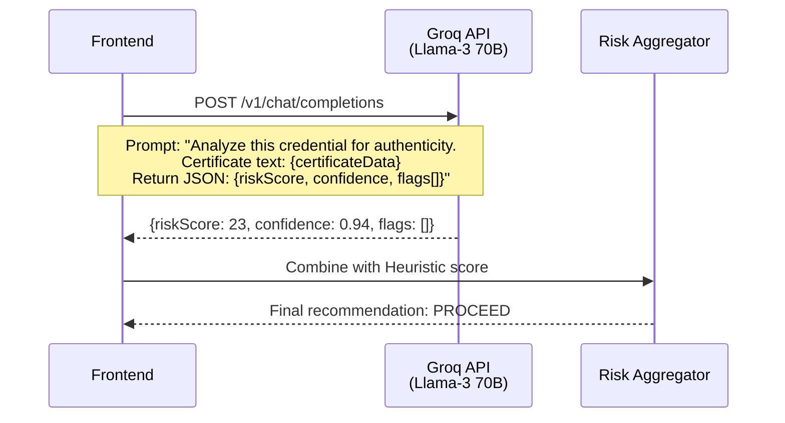
```mermaid
sequenceDiagram
    participant FE as Frontend
    participant GROQ as Groq API<br/>(Llama-3 70B)
    participant AGG as Risk Aggregator

    FE->>GROQ: POST /v1/chat/completions
    Note over FE,GROQ: Prompt: "Analyze this credential for authenticity.<br/>Certificate text: {certificateData}<br/>Return JSON: {riskScore, confidence, flags[]}"
    GROQ-->>FE: {riskScore: 23, confidence: 0.94, flags: []}
    FE->>AGG: Combine with Heuristic score
    AGG-->>FE: Final recommendation: PROCEED
```

---

<a name="blockchain-architecture"></a>
## ⛓️ Blockchain Architecture

### Smart Contract Ecosystem


```mermaid
graph TB
    subgraph CONTRACTS["Soroban Smart Contracts"]
        direction TB
        CERT["📜 Certificate Contract\nCC36B2WFEDYK3GN6F65B7RKAYINW3MGNPYZ2ZG3TM4CQDJQGJURLY2J4"]
        INST["🏛️ Institution Registry Contract"]
        STAKE["💰 Stake Pool Contract"]
    end

    subgraph CERT_FUNCS["Certificate Contract Functions"]
        CF1["issue_certificate(env, hash, owner, type)"]
        CF2["verify_certificate(env, hash) → bool"]
        CF3["get_owner(env, hash) → String"]
        CF4["revoke_certificate(env, hash)"]
        CF5["issue_typed(env, hash, owner, type)"]
    end

    subgraph INST_FUNCS["Institution Registry Functions"]
        IF1["register_institution(id, name, country, wallet, website, type)"]
        IF2["approve_institution(id)"]
        IF3["reject_institution(id)"]
        IF4["suspend_institution(id)"]
        IF5["record_verification(id)"]
        IF6["get_trust_score(id) → u32"]
    end

    subgraph STAKE_FUNCS["Stake Pool Functions"]
        SF1["lock_bond(cert_hash, staker, token)"]
        SF2["release_bond(cert_hash)"]
        SF3["challenge_bond(cert_hash, challenger)"]
        SF4["slash_bond(cert_hash)"]
        SF5["get_bond_status(cert_hash)"]
    end

    CERT --> CERT_FUNCS
    INST --> INST_FUNCS
    STAKE --> STAKE_FUNCS

    classDef contractStyle fill:#2a1a3a,stroke:#e84142,color:#fff,rx:8px
    classDef funcStyle fill:#1e1e2e,stroke:#555,color:#ccc,rx:4px
```

### Certificate Issuance Flow (On-Chain)

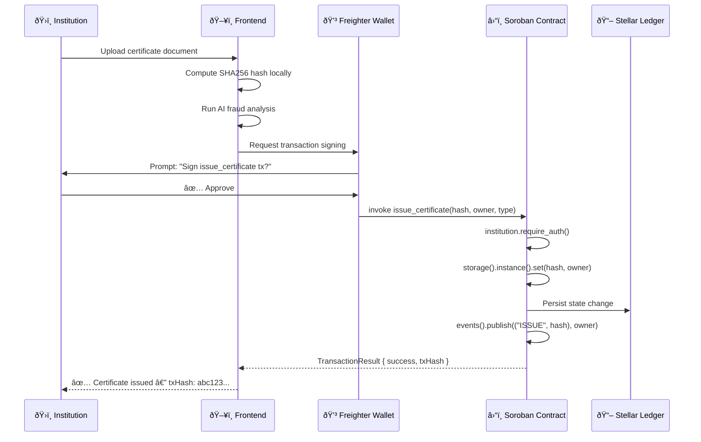
```mermaid
sequenceDiagram
    participant INST as 🏛️ Institution
    participant FE as 🖥️ Frontend
    participant WALLET as 💳 Freighter Wallet
    participant SOROBAN as ⛓️ Soroban Contract
    participant LEDGER as 📖 Stellar Ledger

    INST->>FE: Upload certificate document
    FE->>FE: Compute SHA256 hash locally
    FE->>FE: Run AI fraud analysis
    FE->>WALLET: Request transaction signing
    WALLET->>INST: Prompt: "Sign issue_certificate tx?"
    INST->>WALLET: ✅ Approve
    WALLET->>SOROBAN: invoke issue_certificate(hash, owner, type)
    SOROBAN->>SOROBAN: institution.require_auth()
    SOROBAN->>SOROBAN: storage().instance().set(hash, owner)
    SOROBAN->>LEDGER: Persist state change
    SOROBAN->>SOROBAN: events().publish(("ISSUE", hash), owner)
    SOROBAN-->>FE: TransactionResult { success, txHash }
    FE-->>INST: ✅ Certificate issued — txHash: abc123...
```

### Verification Flow (On-Chain)

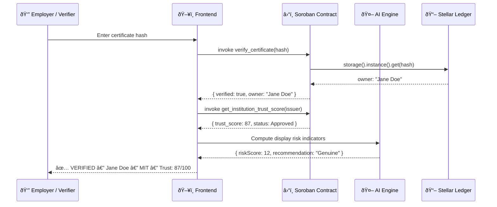
```mermaid
sequenceDiagram
    participant EMP as 👔 Employer / Verifier
    participant FE as 🖥️ Frontend
    participant SOROBAN as ⛓️ Soroban Contract
    participant AI as 🤖 AI Engine
    participant LEDGER as 📖 Stellar Ledger

    EMP->>FE: Enter certificate hash
    FE->>SOROBAN: invoke verify_certificate(hash)
    SOROBAN->>LEDGER: storage().instance().get(hash)
    LEDGER-->>SOROBAN: owner: "Jane Doe"
    SOROBAN-->>FE: { verified: true, owner: "Jane Doe" }
    FE->>SOROBAN: invoke get_institution_trust_score(issuer)
    SOROBAN-->>FE: { trust_score: 87, status: Approved }
    FE->>AI: Compute display risk indicators
    AI-->>FE: { riskScore: 12, recommendation: "Genuine" }
    FE-->>EMP: ✅ VERIFIED — Jane Doe — MIT — Trust: 87/100
```

### Trust Score Calculation

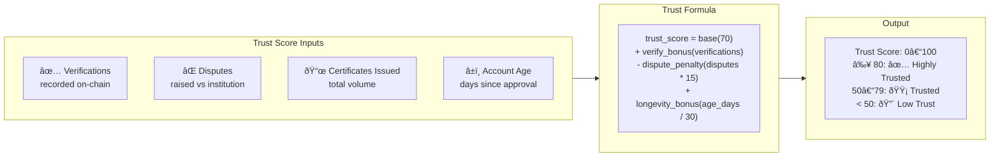
```mermaid
graph LR
    subgraph INPUTS["Trust Score Inputs"]
        V["✅ Verifications\nrecorded on-chain"]
        D["❌ Disputes\nraised vs institution"]
        I["📜 Certificates Issued\ntotal volume"]
        A["⏱️ Account Age\ndays since approval"]
    end

    subgraph FORMULA["Trust Formula"]
        F["trust_score = base(70)\n+ verify_bonus(verifications)\n- dispute_penalty(disputes * 15)\n+ longevity_bonus(age_days / 30)"]
    end

    subgraph OUTPUT["Output"]
        T["Trust Score: 0–100\n≥ 80: ✅ Highly Trusted\n50–79: 🟡 Trusted\n< 50: 🔴 Low Trust"]
    end

    INPUTS --> FORMULA --> OUTPUT
```

---

<a name="database-schema"></a>
## 🗄️ Database Schema

### Supabase PostgreSQL Schema — Entity Relationship

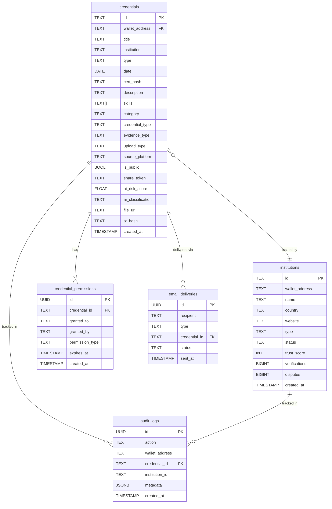
```mermaid
erDiagram
    credentials {
        TEXT id PK
        TEXT wallet_address FK
        TEXT title
        TEXT institution
        TEXT type
        DATE date
        TEXT cert_hash
        TEXT description
        TEXT[] skills
        TEXT category
        TEXT credential_type
        TEXT evidence_type
        TEXT upload_type
        TEXT source_platform
        BOOL is_public
        TEXT share_token
        FLOAT ai_risk_score
        TEXT ai_classification
        TEXT file_url
        TEXT tx_hash
        TIMESTAMP created_at
    }

    institutions {
        TEXT id PK
        TEXT wallet_address
        TEXT name
        TEXT country
        TEXT website
        TEXT type
        TEXT status
        INT trust_score
        BIGINT verifications
        BIGINT disputes
        TIMESTAMP created_at
    }

    credential_permissions {
        UUID id PK
        TEXT credential_id FK
        TEXT granted_to
        TEXT granted_by
        TEXT permission_type
        TIMESTAMP expires_at
        TIMESTAMP created_at
    }

    audit_logs {
        UUID id PK
        TEXT action
        TEXT wallet_address
        TEXT credential_id FK
        TEXT institution_id
        JSONB metadata
        TIMESTAMP created_at
    }

    email_deliveries {
        UUID id PK
        TEXT recipient
        TEXT type
        TEXT credential_id FK
        TEXT status
        TIMESTAMP sent_at
    }

    credentials ||--o{ credential_permissions : "has"
    credentials ||--o{ audit_logs : "tracked in"
    credentials ||--o{ email_deliveries : "delivered via"
    institutions ||--o{ audit_logs : "tracked in"
    credentials }o--|| institutions : "issued by"
```

### Data Flow — Supabase RLS Policies

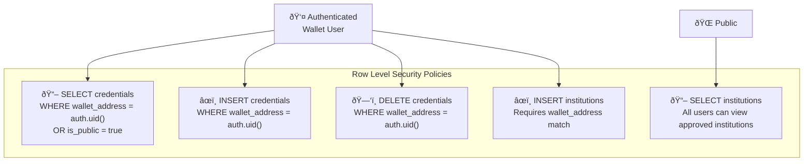
```mermaid
graph TD
    subgraph RLS["Row Level Security Policies"]
        P1["📖 SELECT credentials\nWHERE wallet_address = auth.uid()\nOR is_public = true"]
        P2["✏️ INSERT credentials\nWHERE wallet_address = auth.uid()"]
        P3["🗑️ DELETE credentials\nWHERE wallet_address = auth.uid()"]
        P4["📖 SELECT institutions\nAll users can view approved institutions"]
        P5["✏️ INSERT institutions\nRequires wallet_address match"]
    end

    USER["👤 Authenticated\nWallet User"] --> P1
    USER --> P2
    USER --> P3
    PUBLIC["🌐 Public"] --> P4
    USER --> P5
```

---

## 🛠️ Tech Stack

### Frontend
| Technology | Version | Purpose |
|:---|:---|:---|
| **Next.js** | 15.x | React Framework with App Router, API Routes |
| **TypeScript** | 5.x | Type-safe frontend development |
| **Tailwind CSS** | 3.x | Utility-first styling system |
| **Framer Motion** | 11.x | Fluid animations and micro-interactions |
| **Spline 3D** | Latest | Interactive 3D hero elements |

### Blockchain
| Technology | Version | Purpose |
|:---|:---|:---|
| **Rust** | 1.75+ | Soroban smart contract language |
| **Soroban SDK** | 25.x | Stellar smart contract framework |
| **Stellar SDK (JS)** | Latest | Frontend blockchain interactions |
| **Freighter API** | Latest | Browser wallet integration |

### Backend & Database
| Technology | Version | Purpose |
|:---|:---|:---|
| **Supabase** | Latest | PostgreSQL + Auth + Storage + RLS |
| **Resend** | Latest | Transactional email delivery |
| **Groq API** | Latest | LLM inference (Llama-3 70B) |

### DevOps
| Technology | Purpose |
|:---|:---|
| **GitHub Actions** | CI/CD — auto `cargo test` on every push |
| **Vercel** | Frontend deployment with preview URLs |
| **Stellar CLI** | Contract build, deploy, invoke |

### 💳 Supported Wallets
- **Freighter Wallet** ⭐ (Recommended — full feature support)
- **Albedo** (Web-based signing)
- **xBull Wallet**
- **LOBSTR** (Manual signature flow)

---

<a name="vision"></a>
## 🎯 Vision & Use Cases

### Vision

> *"A world where every credential — from a school certificate to a medical license — can be verified in under 2 seconds, by anyone, anywhere, for free."*

CertifyVal's mission is to become the **global trust layer for human credentials** — the way SSL/TLS became the trust layer for internet data. We aim to make credential fraud as technically impossible as forging a cryptographic signature.

### Use Cases by Sector

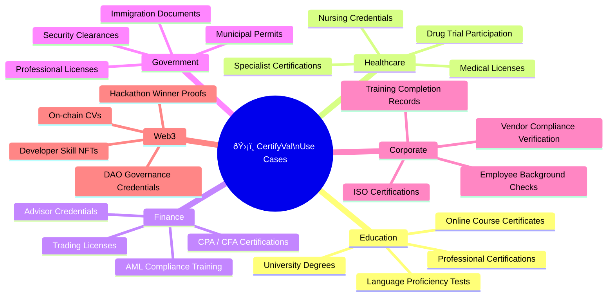
```mermaid
mindmap
  root(("🛡️ CertifyVal\nUse Cases"))
    Education
      University Degrees
      Online Course Certificates
      Professional Certifications
      Language Proficiency Tests
    Healthcare
      Medical Licenses
      Nursing Credentials
      Specialist Certifications
      Drug Trial Participation
    Finance
      CPA / CFA Certifications
      AML Compliance Training
      Trading Licenses
      Advisor Credentials
    Government
      Professional Licenses
      Immigration Documents
      Security Clearances
      Municipal Permits
    Corporate
      Employee Background Checks
      Vendor Compliance Verification
      Training Completion Records
      ISO Certifications
    Web3
      DAO Governance Credentials
      Hackathon Winner Proofs
      Developer Skill NFTs
      On-chain CVs
```

### Market Opportunity

| Market Segment | TAM | CertifyVal's Entry Point |
|:---|:---|:---|
| Credential Verification Software | $1.8B | B2B Institution subscriptions |
| Background Screening | $4.2B | Employer API access |
| EdTech Platform Integrations | $12B | University partnerships |
| Blockchain Identity | $3.7B | Web3 DID standard |
| **Total Addressable Market** | **$21.7B** | **Unified trust protocol** |

---

<a name="architecture-pipeline"></a>
## 🔄 Complete Platform Pipeline

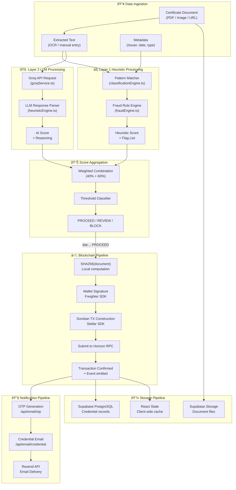
```mermaid
graph TB
    subgraph INGESTION["📥 Data Ingestion"]
        DOC["Certificate Document\n(PDF / Image / URL)"]
        TEXT["Extracted Text\n(OCR / manual entry)"]
        META["Metadata\n(Issuer, date, type)"]
    end

    subgraph HEURISTIC["âš¡ Layer 1 Heuristic Processing"]
        PAT["Pattern Matcher\n(classificationEngine.ts)"]
        FRAUD["Fraud Rule Engine\n(fraudEngine.ts)"]
        HEUR_OUT["Heuristic Score\n+ Flag List"]
    end

    subgraph LLM["🧠 Layer 2 LLM Processing"]
        GROQ_REQ["Groq API Request\n(groqService.ts)"]
        LLM_PARSE["LLM Response Parser\n(heuristicEngine.ts)"]
        LLM_OUT["AI Score\n+ Reasoning"]
    end

    subgraph AGGREGATION["📊 Score Aggregation"]
        COMBINE["Weighted Combination\n(40% + 60%)"]
        THRESHOLD["Threshold Classifier"]
        DECISION["PROCEED / REVIEW / BLOCK"]
    end

    subgraph BLOCKCHAIN_PIPE["⛓️ Blockchain Pipeline"]
        HASH["SHA256(document)\nLocal computation"]
        SIGN["Wallet Signature\nFreighter SDK"]
        TX["Soroban TX Construction\nStellar SDK"]
        SUBMIT["Submit to Horizon RPC"]
        CONFIRM["Transaction Confirmed\n+ Event emitted"]
    end

    subgraph NOTIFICATION["📧 Notification Pipeline"]
        OTP["OTP Generation\n/api/email/otp"]
        CRED_EMAIL["Credential Email\n/api/email/credential"]
        RESEND_OUT["Resend API\nEmail Delivery"]
    end

    subgraph STORAGE["💾 Storage Pipeline"]
        SUPABASE_DB["Supabase PostgreSQL\nCredential records"]
        SUPABASE_STORAGE["Supabase Storage\nDocument files"]
        LOCAL_CACHE["React State\nClient-side cache"]
    end

    DOC --> TEXT --> PAT & GROQ_REQ
    META --> PAT
    PAT --> FRAUD --> HEUR_OUT
    GROQ_REQ --> LLM_PARSE --> LLM_OUT
    HEUR_OUT & LLM_OUT --> COMBINE --> THRESHOLD --> DECISION
    DECISION -->|"✅ PROCEED"| HASH
    HASH --> SIGN --> TX --> SUBMIT --> CONFIRM
    CONFIRM --> OTP --> CRED_EMAIL --> RESEND_OUT
    CONFIRM --> SUPABASE_DB
    DOC --> SUPABASE_STORAGE
    CONFIRM --> LOCAL_CACHE
```

---

<a name="contract"></a>
## 🔗 Mission Credentials

| Category | Identifier / Link |
|:---|:---|
| **Issuer Account ID** | `GA5B7EJJ3SRB2VKWTCKTVWUV6R2UTLUJGRUXWSAAXI3BE4B5PUZZ4YCF` |
| **Transaction Method** | `manageData` (Data Anchoring) |
| **Stellar Explorer** | [View On-Chain Activity](https://stellar.expert/explorer/testnet/account/GA5B7EJJ3SRB2VKWTCKTVWUV6R2UTLUJGRUXWSAAXI3BE4B5PUZZ4YCF) |
| **CI/CD Pipeline** |  |

> [!NOTE]
> This project focuses on **Decentralized Identity and Credentialing**. It anchors data directly to the Stellar ledger using Soroban's native storage — no custom token or liquidity pool required.

### 📸 Smart Contract Dashboard


### Proof of Live Transaction

| Field | Value |
|:---|:---|
| **Issuer Account** | `GA5B7EJJ3SRB2VKWTCKTVWUV6R2UTLUJGRUXWSAAXI3BE4B5PUZZ4YCF` |
| **Operation Type** | `manageData` |
| **Data Key (Cert Hash)** | `CERT_a7ac025645017ad40977d16f63f092ecb0a203a879fdac091a8c175c968` |
| **Data Value** | `Sohan Sarkar Certified Arbitrum Builder` |
| **Status** | ✅ Success |
| **Network** | Stellar Testnet |
| **Fee Charged** | `0.00001 XLM` |
| **Date** | `2026-07-23` |

🔗 [View on Stellar Expert](https://stellar.expert/explorer/testnet/account/GA5B7EJJ3SRB2VKWTCKTVWUV6R2UTLUJGRUXWSAAXI3BE4B5PUZZ4YCF)

### 📸 Transaction Proof Screenshot


---

## 🧪 CI/CD Pipeline

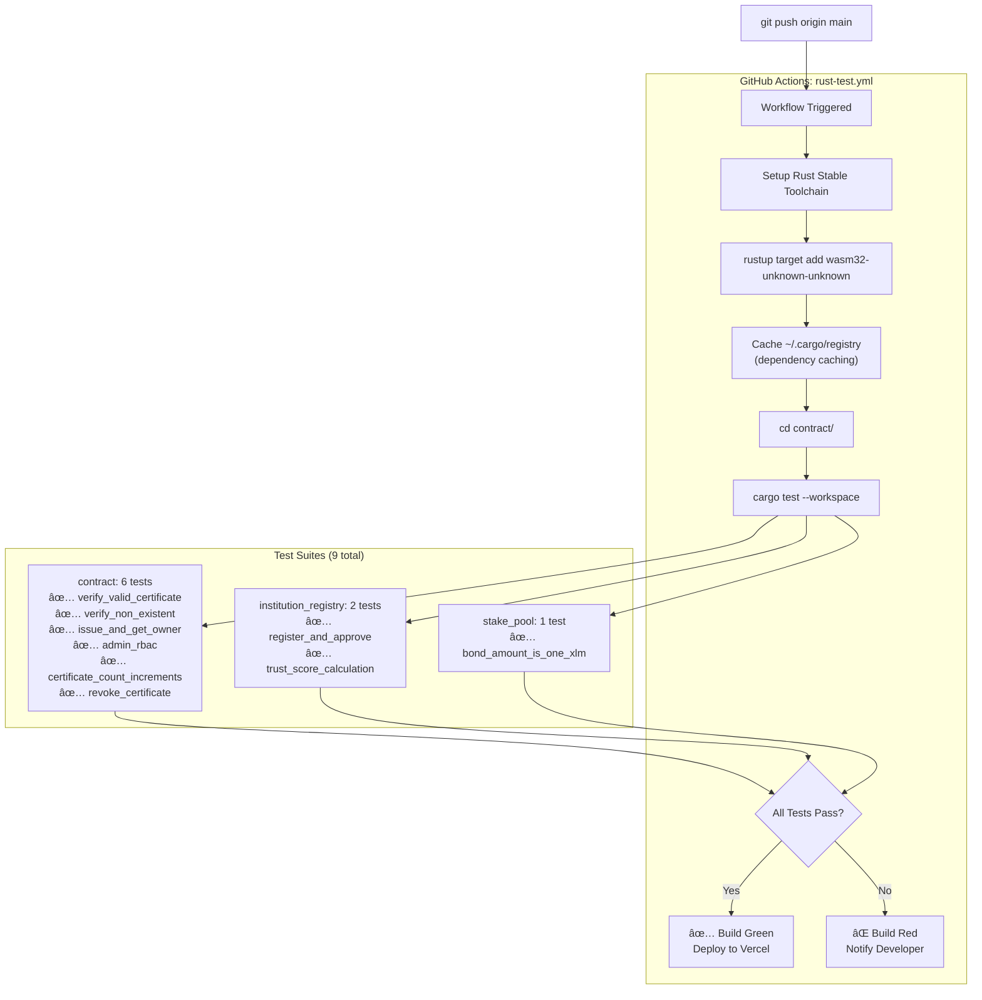
```mermaid
graph TD
    PUSH["git push origin main"]

    subgraph GITHUB_ACTIONS["GitHub Actions: rust-test.yml"]
        TRIGGER["Workflow Triggered"]
        RUST_SETUP["Setup Rust Stable Toolchain"]
        WASM["rustup target add wasm32-unknown-unknown"]
        CACHE["Cache ~/.cargo/registry\n(dependency caching)"]
        WORKSPACE["cd contract/"]
        TEST["cargo test --workspace"]
        RESULT{All Tests Pass?}
        SUCCESS["✅ Build Green\nDeploy to Vercel"]
        FAIL["❌ Build Red\nNotify Developer"]
    end

    subgraph TEST_SUITES["Test Suites (9 total)"]
        T1["contract: 6 tests\n✅ verify_valid_certificate\n✅ verify_non_existent\n✅ issue_and_get_owner\n✅ admin_rbac\n✅ certificate_count_increments\n✅ revoke_certificate"]
        T2["institution_registry: 2 tests\n✅ register_and_approve\n✅ trust_score_calculation"]
        T3["stake_pool: 1 test\n✅ bond_amount_is_one_xlm"]
    end

    PUSH --> TRIGGER
    TRIGGER --> RUST_SETUP --> WASM --> CACHE --> WORKSPACE --> TEST
    TEST --> T1 & T2 & T3
    T1 & T2 & T3 --> RESULT
    RESULT -->|Yes| SUCCESS
    RESULT -->|No| FAIL
```

---

<a name="product-iteration"></a>
## 🔄 Product Iteration (Based on Real User Feedback)

We actively listen to our users and rapidly iterate to improve the platform. Here are some of the recent enhancements directly resulting from real user feedback sessions:

| Component | Status | Improvement | Commit |
|:---|:---:|:---|:---:|
| 📊 **Analytics Dashboard** | ✅ Done | Fixed a visual bug in the **graph bar analytics** where missing tracking events and division by zero prevented total verifications from counting. | [72986a1](https://github.com/sohansarkar07/Digital-certificate-validator-full-project/commit/72986a1) |
| 🗣️ **Feedback Section** | ✅ Done | Upgraded the feedback form to **automatically fetch and pre-fill** the user's name and role from their decentralized profile, eliminating manual typing. | [4042513](https://github.com/sohansarkar07/Digital-certificate-validator-full-project/commit/4042513) |
| 👤 **Profile Section** | ✅ Done | Enhanced the Wallet Profile slide-out to now fetch and prominently display the user's **custom display name and email address**, instead of just their wallet type. | [750f075](https://github.com/sohansarkar07/Digital-certificate-validator-full-project/commit/750f075) |
| 🎨 **UI Overlap Bug** | ✅ Done | Corrected an **overlapping text layout issue** in the Live Blockchain Activity feed where excessively long event types (like `CREDENTIALVERIFICATIONFAILED`) would spill over into transaction hashes. | [e313712](https://github.com/sohansarkar07/Digital-certificate-validator-full-project/commit/e313712) |
| 📜 **Public Verify Page — Scroll** | ✅ Done | Fixed the entire public verification page being **frozen and unscrollable** by mouse wheel. Root cause: global `overflow-hidden` on the body blocked scroll. The verify page now has its own dedicated scroll container. | [7846b8d](https://github.com/sohansarkar07/Digital-certificate-validator-full-project/commit/7846b8d) |
| 🔍 **Certificate Zoom & Scroll** | ✅ Done | Added a **"Scroll & Zoom"** toggle button on the public certificate viewer, allowing users to expand the certificate document to full resolution and scroll through it, then snap back to "Fit to Screen". | [c95d445](https://github.com/sohansarkar07/Digital-certificate-validator-full-project/commit/c95d445) |
| 🗺️ **Routing & Navigation** | ✅ Done | Improved the entire routing structure: tabs now **sync with the URL** (`?tab=verify`), enabling browser back/forward navigation, bookmarkable deep links, and page-refresh state restoration. Added **breadcrumbs**, grouped sidebar sections (**Main / Platform / Administration**), full top nav, functional Settings → Docs and Support → Feedback buttons, and dynamic browser tab titles. | [fc94507](https://github.com/sohansarkar07/Digital-certificate-validator-full-project/commit/fc94507) |

---

<a name="roadmap"></a>
## 🚧 Roadmap & Future Plans

### Development Timeline

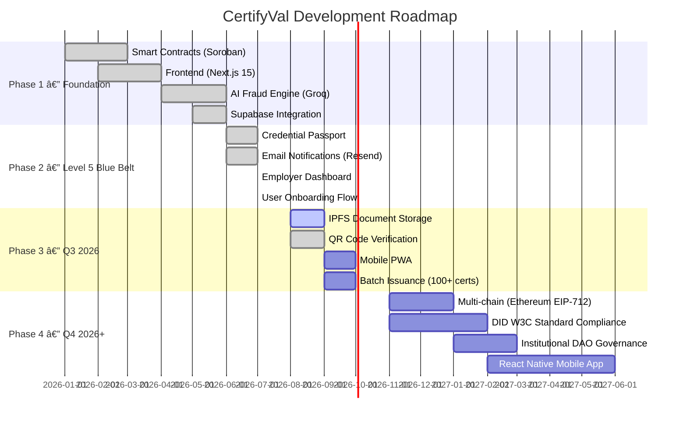
```mermaid
gantt
    title CertifyVal Development Roadmap
    dateFormat  YYYY-MM
    section Phase 1 — Foundation
    Smart Contracts (Soroban)       :done,   p1a, 2026-01, 2026-03
    Frontend (Next.js 15)           :done,   p1b, 2026-02, 2026-04
    AI Fraud Engine (Groq)          :done,   p1c, 2026-04, 2026-06
    Supabase Integration            :done,   p1d, 2026-05, 2026-06

    section Phase 2 — Level 5 Blue Belt
    Credential Passport             :done,   p2a, 2026-06, 2026-07
    Email Notifications (Resend)    :done,   p2b, 2026-06, 2026-07
    Employer Dashboard              :done,   p2c, 2026-07, 2026-07
    User Onboarding Flow            :done,   p2d, 2026-07, 2026-07

    section Phase 3 — Q3 2026
    IPFS Document Storage           :active, p3a, 2026-08, 2026-09
    QR Code Verification            :done,   p3b, 2026-08, 2026-09
    Mobile PWA                      :        p3c, 2026-09, 2026-10
    Batch Issuance (100+ certs)     :        p3d, 2026-09, 2026-10

    section Phase 4 — Q4 2026+
    Multi-chain (Ethereum EIP-712)  :        p4a, 2026-11, 2027-01
    DID W3C Standard Compliance     :        p4b, 2026-11, 2027-02
    Institutional DAO Governance    :        p4c, 2027-01, 2027-03
    React Native Mobile App         :        p4d, 2027-02, 2027-06
```

### Phase 3 — Immediate Next Features

| Priority | Feature | ETA |
|:---:|:---|:---|
| 🔴 | IPFS integration for document storage (Pinata/web3.storage) | Q3 2026 |
| ✅ | QR Code generation for every certificate with scan-to-verify | Q3 2026 |
| 🟡 | Certificate expiry dates on-chain | Q3 2026 |
| 🟡 | Mobile PWA (installable, offline-capable) | Q3 2026 |
| 🟢 | Batch issuance — 100+ certificates in one transaction | Q4 2026 |
| 🟢 | REST API for institutions to integrate programmatically | Q4 2026 |

### Phase 4 — Platform Maturity

- **Multi-chain**: Extend to Ethereum (EIP-712 signed credentials) alongside Stellar
- **W3C DID Standard**: Align with global Decentralized Identity specification
- **Decentralized Dispute Resolution**: On-chain voting for fraudulent credential disputes
- **Institutional DAO**: Governance token for registered institutions to vote on upgrades
- **ISO 21001 Compliance**: International education management standards alignment
- **React Native App**: Native iOS & Android apps

---

## 📁 Project Structure

```text
Digital-certificate-validator-full-project/
│
├── 📄 README.md                          # This document
├── 📄 README_v2_updated.md               # Legacy README reference
│
├── 🦀 contract/                          # Soroban Smart Contracts (Rust)
│   ├── Cargo.toml                        # Workspace config (soroban-sdk = "25")
│   └── contracts/
│       ├── contract/                     # Core Certificate Contract
│       │   ├── Cargo.toml
│       │   └── src/
│       │       └── lib.rs               # issue, verify, get_owner, revoke
│       ├── institution_registry/         # Institution Registry Contract
│       │   ├── Cargo.toml
│       │   └── src/
│       │       └── lib.rs               # register, approve, suspend, trust_score
│       └── stake_pool/                   # Bond & Stake Contract
│           ├── Cargo.toml
│           └── src/
│               └── lib.rs               # lock_bond, release, challenge, slash
│
├── 🌐 frontend/                          # Next.js 15 Frontend
│   ├── next.config.ts                    # Next.js configuration
│   ├── package.json
│   ├── tailwind.config.ts
│   ├── src/
│   │   ├── app/
│   │   │   ├── page.tsx                 # Main landing + app shell
│   │   │   ├── layout.tsx               # Root layout with metadata
│   │   │   ├── globals.css              # Global styles + CSS vars
│   │   │   ├── error.tsx                # Error boundary
│   │   │   ├── not-found.tsx            # 404 page
│   │   │   ├── icon.jpg                 # App favicon
│   │   │   ├── api/
│   │   │   │   └── email/
│   │   │   │       ├── otp/route.ts     # OTP email endpoint
│   │   │   │       └── credential/route.ts # Credential delivery endpoint
│   │   │   └── verify/[id]/             # Public credential verification
│   │   │       ├── page.tsx
│   │   │       └── PublicVerifyClient.tsx
│   │   ├── components/                  # React Components
│   │   │   ├── LandingPage.tsx          # Hero + features landing
│   │   │   ├── BlockchainVerifier.tsx   # Core verification UI
│   │   │   ├── InstitutionDashboard.tsx # Institution issuance portal
│   │   │   ├── CredentialPassport.tsx   # Student credential wallet
│   │   │   ├── CredentialUploadWizard.tsx # Multi-step upload flow
│   │   │   ├── EmployerDashboard.tsx    # Employer bulk verification
│   │   │   ├── AdminPanel.tsx           # Platform admin controls
│   │   │   ├── AIInsightsPanel.tsx      # AI fraud results display
│   │   │   ├── BlockchainActivity.tsx   # Live on-chain activity feed
│   │   │   ├── WalletProfile.tsx        # Wallet info + stats
│   │   │   ├── Documentation.tsx        # In-app docs
│   │   │   ├── NotificationCenter.tsx   # Real-time alerts
│   │   │   ├── ThemeToggle.tsx          # Dark/Light mode switch
│   │   │   ├── Onboarding.tsx           # Role selection wizard
│   │   │   ├── FeedbackPanel.tsx        # User feedback collection
│   │   │   ├── InstitutionRegistry.tsx  # Browse institutions
│   │   │   ├── PendingClaims.tsx        # Pending verification queue
│   │   │   ├── Analytics.tsx            # Dashboard analytics
│   │   │   └── QRCodeDisplay.tsx        # QR code generator
│   │   ├── hooks/
│   │   │   ├── useAuth.tsx              # Wallet auth + session
│   │   │   └── useStellar.tsx           # Stellar blockchain hook
│   │   ├── lib/
│   │   │   ├── supabase.ts              # Supabase client
│   │   │   ├── db.ts                    # Database helpers
│   │   │   ├── types.ts                 # Shared TypeScript types
│   │   │   └── credentialPermissions.ts # Permission system
│   │   └── services/
│   │       ├── blockchain.ts            # Stellar transaction service
│   │       ├── contract.ts              # Certificate contract client
│   │       ├── institutionContract.ts   # Institution contract client
│   │       ├── stakeContract.ts         # Stake pool client
│   │       ├── notificationService.ts   # Push notification service
│   │       ├── emailService.ts          # Email service wrapper
│   │       └── ai/
│   │           ├── groqService.ts       # Groq LLM API integration
│   │           ├── heuristicEngine.ts   # Rule-based fraud detection
│   │           ├── fraudEngine.ts       # Combined fraud orchestrator
│   │           └── classificationEngine.ts # Document classifier
│   └── supabase/
│       ├── schema.sql                   # Full database schema
│       └── migration_v3_credential_delivery.sql
│
├── 🤖 .github/
│   └── workflows/
│       └── rust-test.yml               # CI/CD pipeline
│
├── 🖼️ assets/                           # Documentation screenshots
│   ├── issuance-portal.png
│   ├── verify-portal.png
│   ├── mobile-view.png
│   └── tx-proof.png
│
└── 📋 demo_credential_01.txt            # Sample credential for testing
```

---

<a name="setup"></a>
## ⚙️ Quick Start

### Prerequisites

```bash
# 1. Install Rust
curl --proto '=https' --tlsv1.2 -sSf https://sh.rustup.rs | sh

# 2. Add WASM target
rustup target add wasm32-unknown-unknown

# 3. Install Stellar CLI
cargo install --locked stellar-cli --features opt
```

### Smart Contract Setup

```bash
# Clone the repository
git clone https://github.com/sohansarkar07/Digital-certificate-validator-full-project.git
cd Digital-certificate-validator-full-project/contract

# Run all tests (9 tests across 3 contracts)
cargo test

# Build contracts
stellar contract build

# Deploy to testnet
stellar contract deploy \
  --wasm target/wasm32-unknown-unknown/release/contract.wasm \
  --source <YOUR_ACCOUNT> \
  --network testnet
```

### Frontend Setup

```bash
cd frontend

# Install dependencies
npm install

# Copy environment variables
cp .env.local.example .env.local
# Fill in: NEXT_PUBLIC_SUPABASE_URL, NEXT_PUBLIC_SUPABASE_ANON_KEY, GROQ_API_KEY, RESEND_API_KEY

# Run development server
npm run dev
# → Open http://localhost:3000
```

### Environment Variables

```env
# Supabase
NEXT_PUBLIC_SUPABASE_URL=https://your-project.supabase.co
NEXT_PUBLIC_SUPABASE_ANON_KEY=your-anon-key

# AI
GROQ_API_KEY=gsk_your_groq_api_key

# Email
RESEND_API_KEY=re_your_resend_key

# Blockchain (optional — defaults to testnet)
NEXT_PUBLIC_STELLAR_NETWORK=testnet
NEXT_PUBLIC_CONTRACT_ID=CC36B2WFEDYK3GN6F65B7RKAYINW3MGNPYZ2ZG3TM4CQDJQGJURLY2J4
```

---

## 📋 Level 5 Blue Belt — User Onboarding & Feedback

### Google Form — User Feedback Collection

We collect user details including **wallet address, email, name, and product feedback (rating)** via Google Form:

🔗 **[CertifyVal User Feedback Form](https://docs.google.com/forms/d/e/1FAIpQLSeTacaTE5WdiziG8oA6qHFntoSKmnlPN_es5Chn5q7jiOEwbQ/viewform?usp=publish-editor)**

Fields collected:
- Full Name
- Email Address
- Stellar Wallet Address
- Product Rating (1–5 stars)
- Feedback / Feature Requests

### 📊 Exported User Responses

📎 **[Download User Responses (Excel)](https://docs.google.com/spreadsheets/d/1KkirRluFDUFCoo5sLA4LoxLYy0ZxEHPbe_fjbee3U7w/edit?usp=sharing)**

### 📽️ PPT Presentation

📎 **[View Project Presentation (Google Drive)](https://drive.google.com/file/d/13R5k0awT4VD1-IW8M5MIOfXvL9BKrIWX/view?usp=drivesdk)**

---

## 👨‍💻 Author

**Sohan Sarkar**
- Blockchain Developer | Soroban Specialist | Full-Stack Engineer
- [GitHub Profile](https://github.com/sohansarkar07)
- [Repository](https://github.com/sohansarkar07/Digital-certificate-validator-full-project)

---

## 📜 License

This project is licensed under the MIT License - see the [LICENSE](LICENSE) file for details.

---

<div align="center">

> **Last Updated:** July 2026 — Level 5 Blue Belt Submission for RiseIn.
>
> Built with ❤️ on Stellar Soroban — *The blockchain built for the real world.*

</div>

